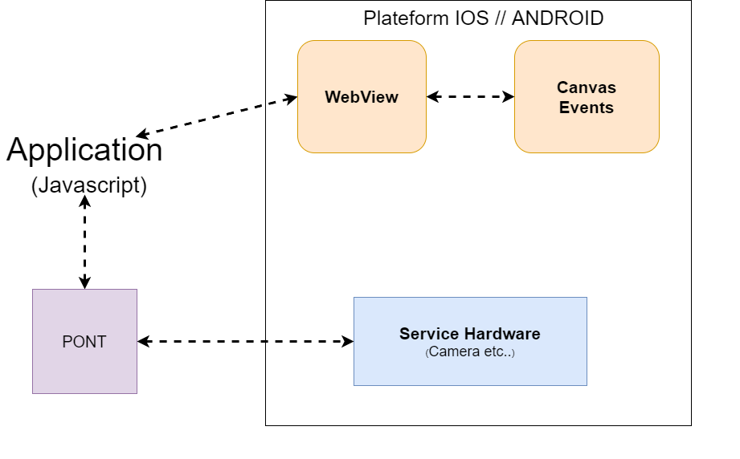
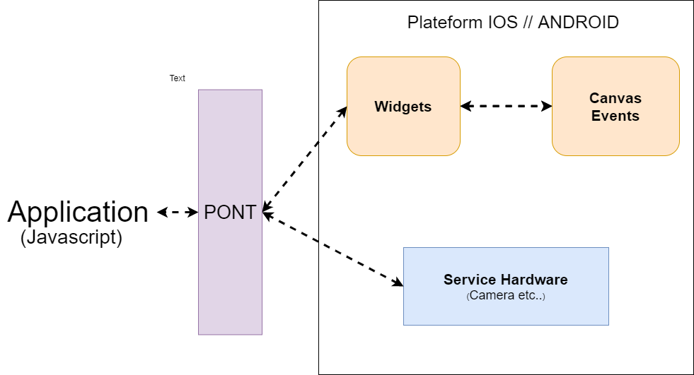
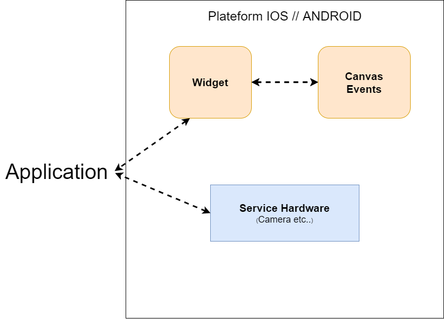

# La solution Flutter

Flutter est un framework crée en 2017 par Google
ce framework a été déclaré stable et à pu voir une sortie de sa bêta en juin 2018, puis sa version 1.5 en 2019

ce langage utilise le **Dart** qui est un lnagage crée par google qui peut être compilé en code bas niveau ou transpilé en Javascript.

### Qui utilise Flutter ?

Flutter est utilisé principalement par google avec les applications:

- **Stadia** appli pour les jeux cloud google

- **Ads** appli permet aux utilisateurs de gérer, d'optimiser et de suivre les campagnes publicitaires à partir de la commodité d'un appareil Android

- **Greentea** Une application de gestion de la clientèle interne largement utilisée par les ventes de Google qui fournit des visualisations riches pour suivre les objectifs de vente.

Mais Flutter est aussi utiliser par des grande entreprise tel que:

- **Alibaba**
  Flutter a aidé à donner vie à une nouvelle application pour le plus grand marché en ligne du monde.

- **philips**
  Flutter a apporté des commandes intuitives aux applications Philips Hue, permettant aux utilisateurs de définir l'ambiance et de synchroniser leurs lumières intelligentes avec leurs médias rapidement et facilement.

- **nuBank**
  Flutter a aidé Nubank dans sa mission de mettre fin à la complexité des banques traditionnelles et de remettre le contrôle financier entre les mains de l'utilisateur

Ainsi que **Toutiao**, **Xigua Video**, **Helo**, **Topbuzz** et de nombreuses autres applications utilisées par des centaines de millions d'utilisateurs ont été développées avec Flutter.

Vous pouvez ici visualiser toutes les sources que je viens de vous citez [showcase](https://flutter.dev/showcase)
et vous pouvez voir avec le lien ci-dessous des exemples d'application avec Flutter
[itsallwidgets](https://itsallwidgets.com/)

### Avantages de Flutter

Brièvement voici les avantages de Flutter:

- **Crée des applications hybrides réactives sans utilisation de pont `Javascript / Plateform` dégradant les performances**
- **type de compilation `AOT` comme le `C/C++`,code pré-compilé en code natif bas niveau donc une meilleur performance** [source](https://proandroiddev.com/flutters-compilation-patterns-24e139d14177)
- **Les fonctinalité tel que `Widgets` et `Layout` entièrement personnalisable sans perte de performance** [source](https://flutter.dev/docs/development/ui/layout)
- **Une importante librairie de widget baseline** [source](https://flutter.dev/docs/development/ui/widgets)
- **Le nouvel `OS` de google `Fushia` utilisera Flutter donc `Futur proof`** [source](https://medium.com/swlh/flutter-and-fuchsia-the-death-of-react-android-a34f6d12bb82) [source](https://medium.com/swlh/why-businesses-should-start-focusing-on-googles-flutter-and-fuchsia-48e16820f2a9)
- **La techno n'est pas délaissé au vues des appli que google sorte donc il est souvent maintenu et mis à jours**
- **Dans un futur proche Flutter sera la seul technologie multiplateform `Android`,`IOS`, `web`, `Desktop` grace au projet [hummingbird](https://kodytechnolab.com/flutter-web-hummingbird)**

### Les autres solutions

Bien qu'il y'ai plusieurs type d'aborder la solution applicative comme

- Les appli **webview** utiliser par `Ionic`
  
- Les appli **reactive** utiliser par `React-native`
  
  Il y'a une petite subtilité ici, à première vue si on compare les architecture de Ionic et de react-native on pourrait croire que Ionic est bien meilleur d'un point de vue performance, sauf qu'il faut savoir que react-native utilise 3 thread
  - Un pour le **javascript**
  - Un pour le **pont entre le javascript et le service hardware**
  - Un pour le **rendu final** la partie dessins
- Les appli **native** comme `java`,`swift` 
